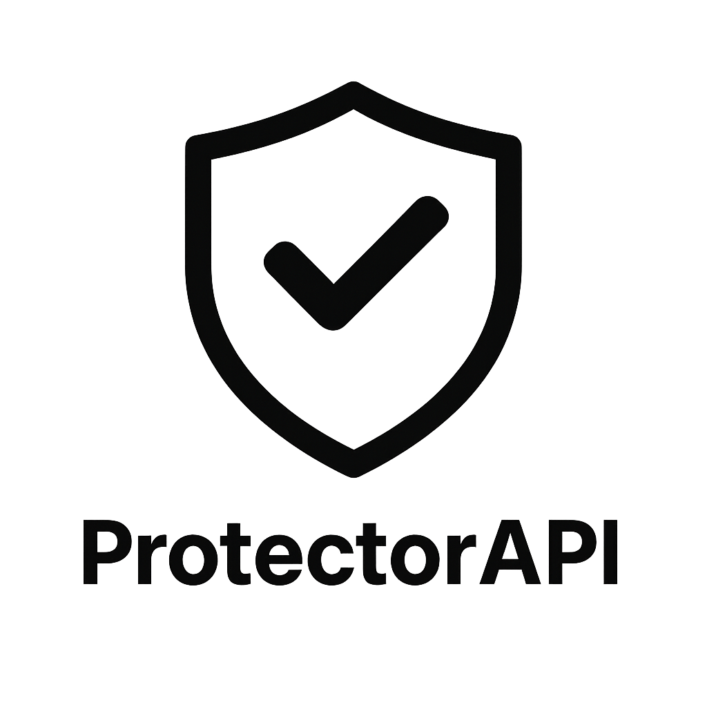

<div align="center">
  
  <h1>ProtectorAPI</h1>

<a href="https://modrinth.com/plugin/protectorapi"></a>
<a href="https://www.spigotmc.org/resources/protectorapi.126828/"></a>
<a href="https://hangar.papermc.io/lijinhong11/ProtectorAPI/"></a>
<a href="https://lijinhong11.gitbook.io/protectotapi/"></a>

  <p>
    An API used to docking almost all protection plugins.<br>
    Intended to provide a more standardized universal API.
  </p>
</div>

## Usage & Develop

See wiki: https://lijinhong11.gitbook.io/protectotapi/

## Building

Make sure you have installed:

1. JDK 17
2. JDK 25 (for compiling the ExcellentClaims, FactionsUUID and LandClaimPlugin adapters)

Gradle automatically detects installed JDKs. Use the included Gradle wrapper:

```sh
./gradlew clean build
```

On Windows, run `gradlew.bat clean build`.

The plugin JAR is generated at `plugin/build/libs/ProtectorAPI-Plugin-2.3.0.jar`.
All ProtectorAPI modules target Java 17, including the adapters compiled with JDK 25.
Protection plugin dependencies are compile-only and are not bundled in the plugin JAR.

### Runtime compatibility

ProtectorAPI requires Java 17 or newer. The server and installed protection plugins
must also support the Java version you use. In particular, the currently integrated
ExcellentClaims 2.0.1 and LandClaimPlugin 3.0.0 require Java 25, and FactionsUUID 0.7.0
requires Java 21; their adapters are only activated when those plugins are enabled.

The Java 17 compile-time baselines are WorldGuard 7.0.9, WorldEdit 7.2.18,
PlotSquared 7.3.0 and Bolt 1.0.580.

## Develop Examples

### Async protection checks

Use `allowBreakAsync`, `allowPlaceAsync`, or `allowInteractAsync` to check protection
without waiting for asynchronous work on the server thread. Each returns a
`CompletableFuture<Boolean>`:

- `(Player, Location)` checks region and block protection at the target location.
- `(Player)` captures the player's location on the server thread and checks region protection there.
- `findModuleAsync`, `findBlockModuleAsync`, and `isInProtectionRangeAsync` provide asynchronous lookup entry points.

Only verified thread-safe operations run asynchronously; other operations stay on
the server thread. See the [async support audit](ASYNC_SUPPORT_AUDIT.md) for adapter
support and verification details.

```java
Location target = block.getLocation(); // capture on the server thread
ProtectorAPI.allowBreakAsync(player, target).whenComplete((allowed, error) -> {
    Bukkit.getScheduler().runTask(myPlugin, () -> {
        if (error != null) {
            myPlugin.getLogger().log(Level.WARNING, "Protection check failed", error);
            return;
        }
        if (player.isOnline()) {
            player.sendMessage(allowed ? "Allowed" : "Denied");
        }
    });
});
```

Completion may occur on either thread, so schedule Bukkit world/player operations
back onto the server thread as shown above. Never wait with `join()` or `get()` on
the server thread. An asynchronous result cannot retroactively cancel a synchronous
Bukkit event; finish the check before performing a deferred action. Existing boolean
methods remain synchronous.

### Check whether a player can place

```java
Player player = ...;

boolean allow = ProtectorAPI.allowPlace(player);
```

If you need to check wehether a player can place a block at a location (safer than previous method):

```java
Player player = ...;
Block block = ...;

boolean allow = ProtectorAPI.allowPlace(player, block);
```

### Check whether a player can break

```java
Player player = ...;

boolean allow = ProtectorAPI.allowBreak(player);
```

If you need to check whether a player can break a block at a location (safer than previous method):

```java
Player player = ...;
Block block = ...;

boolean allow = ProtectorAPI.allowBreak(player, block);
```

### Check whether a player can interact

**NOTE: RedProtect didn't have a more general interaction flag, so we uses "redstone" flag to check instead.**

```java
Player player = ...;

boolean allow = ProtectorAPI.allowInteract(player);
```

If you need to whether a player can interact block at a location (safer than previous method):

```java
Player player = ...;
Block block = ...;

boolean allow = ProtectorAPI.allowInteract(player, block);
```
